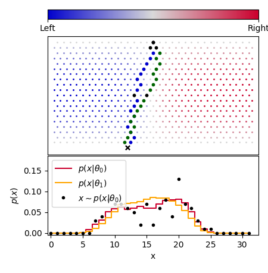
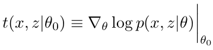
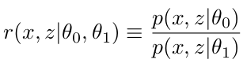
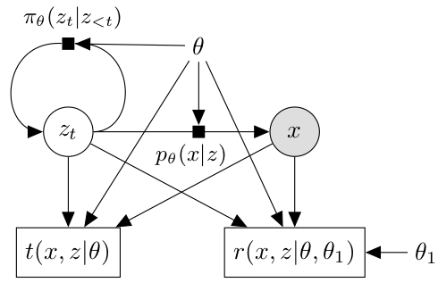
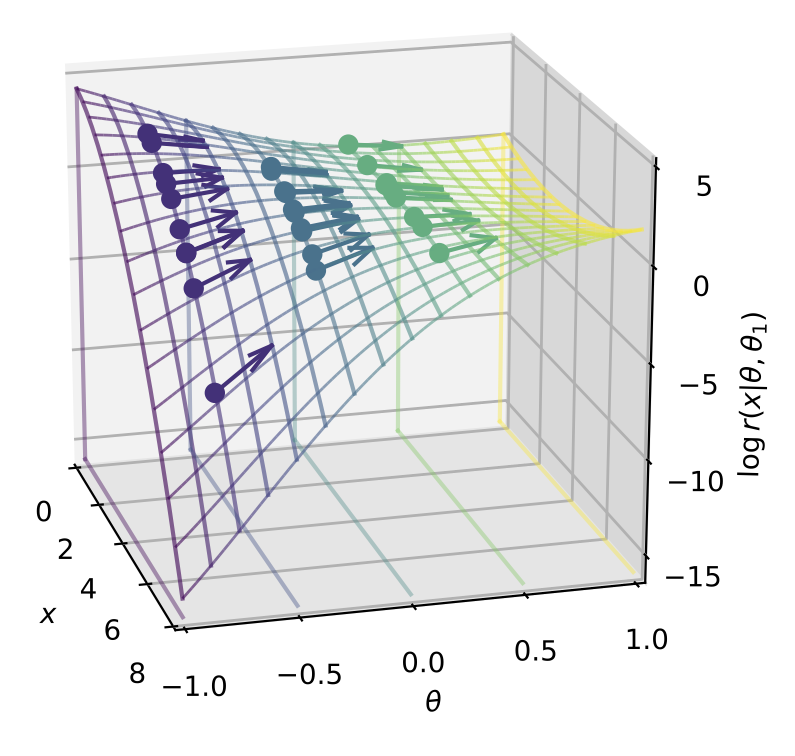

# Simulator Mining Example 

Code repository for the generalized Galton board example in the paper "Mining gold from implicit models to improve likelihood-free inference" by Johann Brehmer, Gilles Louppe, Juan Pavez, and Kyle Cranmer. 

## Abstract

Simulators often provide the best description of real-world phenomena; however, they also lead to challenging inverse problems because the density they implicitly define is often intractable. Typically the setting of likelihood-free inference methods assumes that the only available output from the simulator are samples of observations `x ∼ p(x|θ)`. However, in many cases additional information can be extracted from the simulator, and  this “augmented” data can dramatically improve sample efficiency and quality of likelihood- free inference. We playfully introduce the analogy of **mining gold** as this augmented data requires work to extract and is very valuable.

## Generalized Galton Board Example

As a motivating example, consider the simulation for a generalization of the Galton board, in which a set of balls is dropped through a lattice of nails ending in one of several bins denoted by `x`. The Galton board is commonly used to demonstrate the central limit theorem, and if the nails are uniformly placed such that the probability of bouncing to the left is `p`, the sum over the latent space is tractable analytically and the resulting distribution of `x` is a binomial distribution with `N_rows` trials and probability `p` of success. However, if the nails are not uniformly placed, and the probability of bouncing to the left is an arbitrary function of the nail position and some parameter `θ`, the resulting distribution requires an explicit sum over the latent paths `z` that might lead to a particular x. Such a distribution would become intractable as Nrows, the size of the lattice of nails, increases. Figure 1a shows an example of two latent trajectories that lead to the same x. In this toy example, the probability `p(zh, zv, θ)` of going left is given by `(1−f(zv))/2+f(zv)σ(5θ(zh −1/2))`, where `f(zv) = sin(πzv)`, `σ` is the sigmoid function, and `zh` and `zv` are the horizontal and vertical nail positions normalized to `[0, 1]`. This leads to a non-trivial `p(x|θ)`, which can even be bimodal. While `p(x|θ)` is intractable, the joint score
􏰀
can be computed by accumulating the factors `∇_θ log p(zh,zv|θ)` as the simulation runs forward through its control flow conditioned on the random trajectory `z`. A similar trick can be applied to extract the joint likelihood ratio

<!--

-->

 

