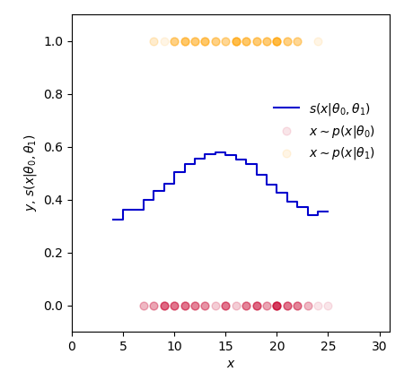
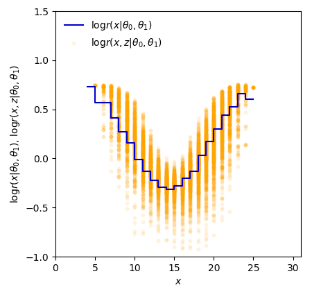
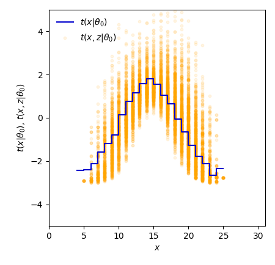
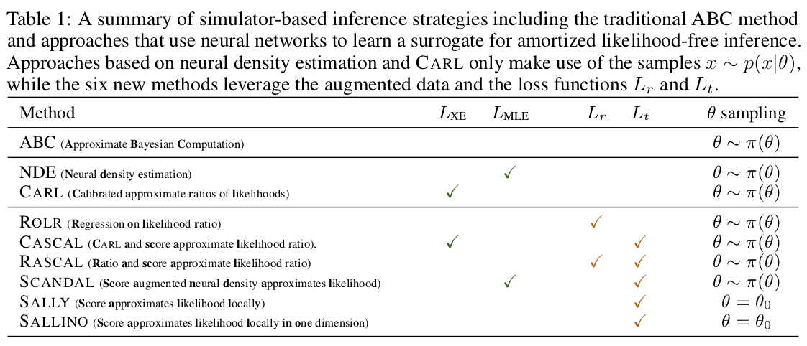
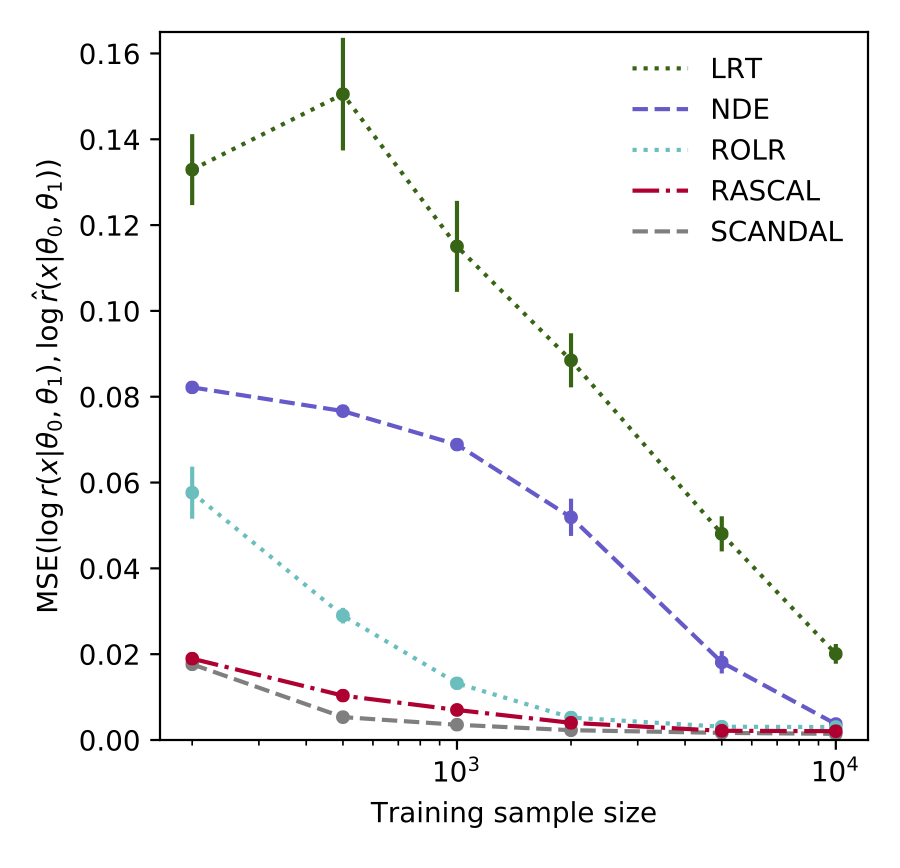

# Simulator Mining Example [](https://mybinder.org/v2/gh/johannbrehmer/simulator-mining-example/master)

Code repository for the generalized Galton board example in the paper "Mining gold from implicit models to improve likelihood-free inference" by Johann Brehmer, Gilles Louppe, Juan Pavez, and Kyle Cranmer. 

## Introduction

Simulators often provide the best description of real-world phenomena; however, they also lead to challenging inverse problems because the density they implicitly define is often intractable. Typically the setting of likelihood-free inference methods assumes that the only available output from the simulator are samples of observations `x ∼ p(x|θ)`. However, in many cases additional information can be extracted from the simulator, and  this “augmented” data can dramatically improve sample efficiency and quality of likelihood-free inference. We playfully introduce the analogy of **mining gold** as this augmented data requires work to extract and is very valuable. Furthermore, we have introduced a suite of new simulation-based inference techniques that exploit this augmented data. 

This repository provides an explicit example of mining for a toy simulator and a notebook demonstraiting the new simulation-based inference techniques. While these examples are meant to be pedagogical, the techniques have been used in real-world examples in particle physics (see [arXiv:1805.00013](https://arxiv.org/abs/1805.00013) and [arXiv:1805.00020](https://arxiv.org/abs/1805.00020)).


## Generalized Galton board Example


As a motivating example, consider the simulation for a generalization of the [Galton board](https://en.wikipedia.org/wiki/Bean_machine) (or "bean machine"), in which a set of balls is dropped through a lattice of nails ending in one of several bins denoted by `x`. The Galton board is commonly used to demonstrate the central limit theorem, and if the nails are uniformly placed such that the probability of bouncing to the left is `p`, the sum over the latent space is tractable analytically and the resulting distribution of `x` is a binomial distribution with `N_rows` trials and probability `p` of success. However, if the nails are not uniformly placed, and the probability of bouncing to the left is an arbitrary function of the nail position and some parameter `θ`, the resulting distribution requires an explicit sum over the latent paths `z` that might lead to a particular `x`. Such a distribution would become intractable as `N_rows`, the size of the lattice of nails, increases. The figure to the right shows an example of two latent trajectories that lead to the same `x`. In this toy example, the probability `p(zh, zv, θ)` of going left is given by `(1−f(zv))/2+f(zv)σ(5θ(zh −1/2))`, where `f(zv) = sin(πzv)`, `σ` is the sigmoid function, and `zh` and `zv` are the horizontal and vertical nail positions normalized to `[0, 1]`. This leads to a non-trivial `p(x|θ)`, which can even be bimodal. While `p(x|θ)` is intractable, the joint score
􏰀
can be computed by accumulating the factors `∇_θ log p(zh,zv|θ)` as the simulation runs forward through its control flow conditioned on the random trajectory `z`. A similar trick can be applied to extract the joint likelihood ratio
.

The file [galton.ipynb](galton.ipynb) defines three variations of the simulator:

 * `galton_rvs_vanilla`: only returns `x~p(x|θ)`
 * `galton_rvs_score`: returns `x~p(x|θ)` as well as the joint score `t(x,z|θ)`
 * `galton_rvs_ratio`: returns `x~p(x|θ)` as well as the joint score `t(x,z|θ)` and the joint ratio `r(x,z|θ0,θ1)`

and the function `trace` has comments `# for mining` that show the accumulation of the information needed for the joint ratio and score. The notebook [Draw Galton Board.ipynb](Draw%20Galton%20Board.ipynb) runs the simulator and produces the figures above and below. The left plot below shows the data being presented to to techniques based data from the vanilla version of the simulator used for density estimation and the likelihood ratio trick. The center and right plots below show the augmented data mined from the simulator, which is clearly much more informative.

<div>



</div>


## Learning from augmented data

The notebook [Inference on Galton Board.ipynb](Inference%20on%20Galton%20Board.ipynb) uses the augmented data mined from the simulators to demonstrate the new simulation-based inference methods. The table below summarizes which methods utilize the joint score and joint ratio via the loss functions `L_t` and `L_r` .

<div>


</div>


<!--
<div>


</div>
-->


## Abstraction

The left figure below shows a probabilistic graphical model that summarizes a generic simulator, where the boxes indicate the joint score and joint ratio that can be mined from the simulator. The right figure below is a schematic diagram illustraiting the joint ratio (dots) and joint score (arrows) fluctuating around the intractable likelihood ratio implicitly defined by the simulator.

<div>


</div>


## References

The main reference for the new inference methods is
```
@article{Brehmer:2018XXX,
      author         = "Brehmer, Johann and Louppe, Gilles and Pavez, Juan and
                        Cranmer, Kyle",
      title          = "{Mining gold from implicit models to improve likelihood-free inference}",
      year           = "2018",
      eprint         = "1805.XXXXX",
      archivePrefix  = "arXiv",
      primaryClass   = "hep-ph",
      SLACcitation   = "%%CITATION = ARXIV:1805.XXXXX;%%"
}
```

CARL was introduced in
```
@article{Cranmer:2015bka,
      author         = "Cranmer, Kyle and Pavez, Juan and Louppe, Gilles",
      title          = "{Approximating Likelihood Ratios with Calibrated
                        Discriminative  Classifiers}",
      year           = "2015",
      eprint         = "1506.02169",
      archivePrefix  = "arXiv",
      primaryClass   = "stat.AP",
      SLACcitation   = "%%CITATION = ARXIV:1506.02169;%%"
}
```

The new techniques were applied to a class of problems from particle physics in
```
@article{Brehmer:2018kdj,
      author         = "Brehmer, Johann and Cranmer, Kyle and Louppe, Gilles and
                        Pavez, Juan",
      title          = "{Constraining Effective Field Theories with Machine
                        Learning}",
      year           = "2018",
      eprint         = "1805.00013",
      archivePrefix  = "arXiv",
      primaryClass   = "hep-ph",
      SLACcitation   = "%%CITATION = ARXIV:1805.00013;%%"
}
```
and
```
@article{Brehmer:2018eca,
      author         = "Brehmer, Johann and Cranmer, Kyle and Louppe, Gilles and
                        Pavez, Juan",
      title          = "{A Guide to Constraining Effective Field Theories with
                        Machine Learning}",
      year           = "2018",
      eprint         = "1805.00020",
      archivePrefix  = "arXiv",
      primaryClass   = "hep-ph",
      SLACcitation   = "%%CITATION = ARXIV:1805.00020;%%"
}
```


